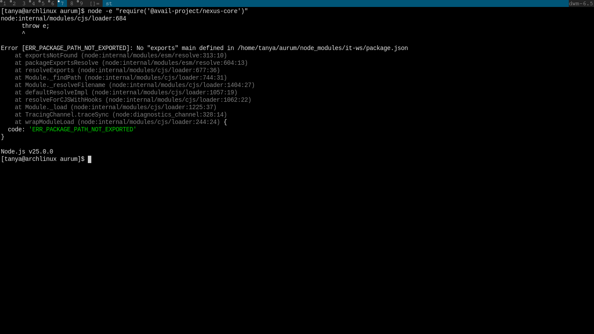

# Avail nexus SDK feedback

## Feedback 1 – Backend attestation + settlement path is undocumented and likely unavailable, documentation is not API-first
- Context: I built a non-custodial, cross chain subscription manager where users sign EIP-712 intents in their wallet, and a relayer validates and records the intent, publishes it to Avail DA for tamper-proof provenance, then executes each due payment on L2 using live balance/allowance checks so funds never leave the user’s wallet until execution. I tried to implement Nexes SDK so that immediately after a subscription executes we can submit a payment attestation and trigger settlement. i searched `nexus-quickstart/nexus-core.html`, `avail-nexus-sdk/nexus-core/api-reference.html`, and the linked concept pages for any mention of an attestation endpoint or solver api.
  - The SDK surface only exposes wallet-centric methods (`getUnifiedBalances`, `transfer`, `bridge`, `bridgeAndExecute`). no method resembles `submitPaymentAttestation`, `createIntent`, or `pollSettlement`.
  - I tried importing `@avail-project/nexus-core` from node (so the relayer can call it) throws `ERR_PACKAGE_PATH_NOT_EXPORTED` because the dependency `it-ws` only ships browser entry points, even when manually importing `dist/index.js`, there is still no documented route to submit the attestation payload we already assemble (subscription id, payment number, merchant, token, tx hash, timestamp). Documentation never specifies where payment attestations should be posted, which signer/account is expected on the backend, or how solvers communicate completion.
- The SDK is helpful for frontend demos, but backend services need stable REST/GraphQL endpoints rather than only JavaScript helpers, please expose key functionality as public API endpoints so Rust, Go, or Python services can integrate without a browser runtime.

## Feedback 2 – No documented way to register pyusd (or any custom erc-20) with the sdk/widgets
- I wanted to present pyusd inside the bridge widget so judges can see the actual token we use. the quickstart implies that `BridgeButton` accepts arbitrary tokens via `prefill`, but both `@avail-project/nexus-widgets` and the shared commons package hard-code `SUPPORTED_TOKENS = 'ETH' | 'USDC' | 'USDT'`. Passing `"PYUSD"` throws a type error and the widget refuses to render. There is no mention of a configuration hook to extend the token list, override decimals, or supply chain-specific addresses. The docs never mention token extensibility, so troubleshooting burned hours verifying our config before discovering the limitation in source. 
- If token support isn’t dynamic, the docs should state that upfront and outline how to handle unsupported assets. Even a short section referencing external swap or liquidity layers (e.g. Uniswap, Aerodrome, Matcha, or a 0x aggregator) would go a long way in helping builders route conversions before bridging. Since most cross-chain UX relies on pre-swap steps, this context is pretty important. The widget being hard-locked to 3 tokens makes it effectively impossible to build an interoperable UX.
  - Please add a documented mechanism to register additional erc-20 metadata (symbol, decimals, chain addresses) for both the core sdk and widgets. If custom tokens are not yet supported, communicate that clearly so teams can plan alternative presentations or integrate external swap providers early in their design.
## Feedback 3 –  Prerequisite configuration is scattered and need assisted discovery 
  - The quickstart references app ids and signer keys but does not link to the provisioning steps. The relevant guide lives under `docs/learn-about-avail/app-ids.html` in the data availability section, far from the nexus pages.
  - Missing prerequisites cause unclear runtime errors (e.g. `requestForFunds not authorised`), making it unclear whether the issue is our configuration or the sdk.
- Finding relevant functions or parameters requires a lot of manual digging through nested pages. Until the docs are proper, adding an AI-powered search (semantic query + contextual snippets) or a chatbot trained on the docs would make it far easier to locate the correct API or concept. 
## Feedback 4 – Documentation is too next.js-opinionated and missing real-world context and usage patterns
- All code snippets assume a Next.js frontend with React hooks. This makes backend or non-React integrations difficult and hard to follow along. Please make it framework-agnostic (include plain TypeScript / JavaScript usage snippets and clearly mark which examples are frontend-only)
- Most examples are too generic, builders working on complex systems (e.g., payment processors, subscription logic, marketplaces) have to reverse-engineer workflows. Please add domain-specific walkthroughs, and public examples of how existing companies or teams use Avail Nexus SDK in production Without that, new builders have no mental model for system design.